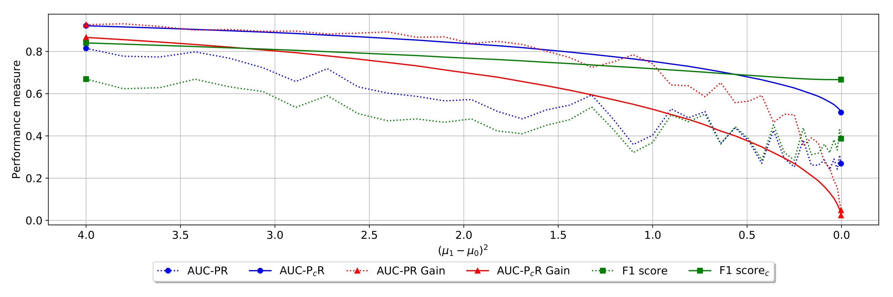
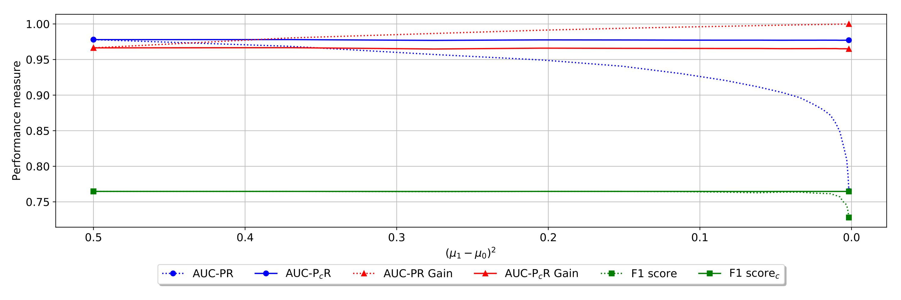
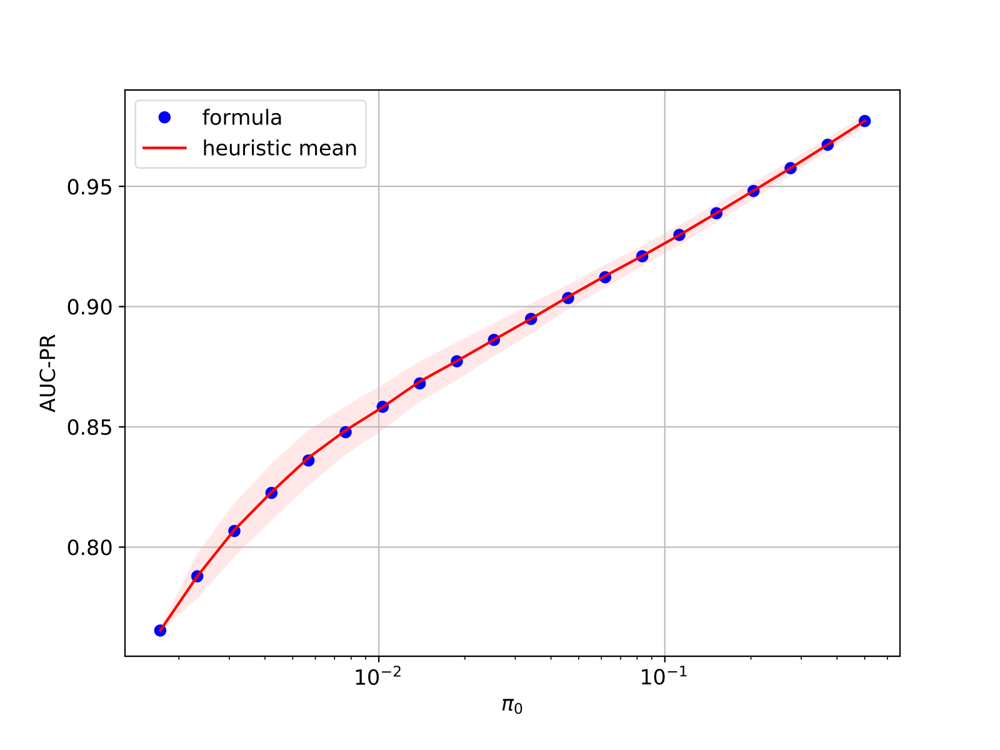
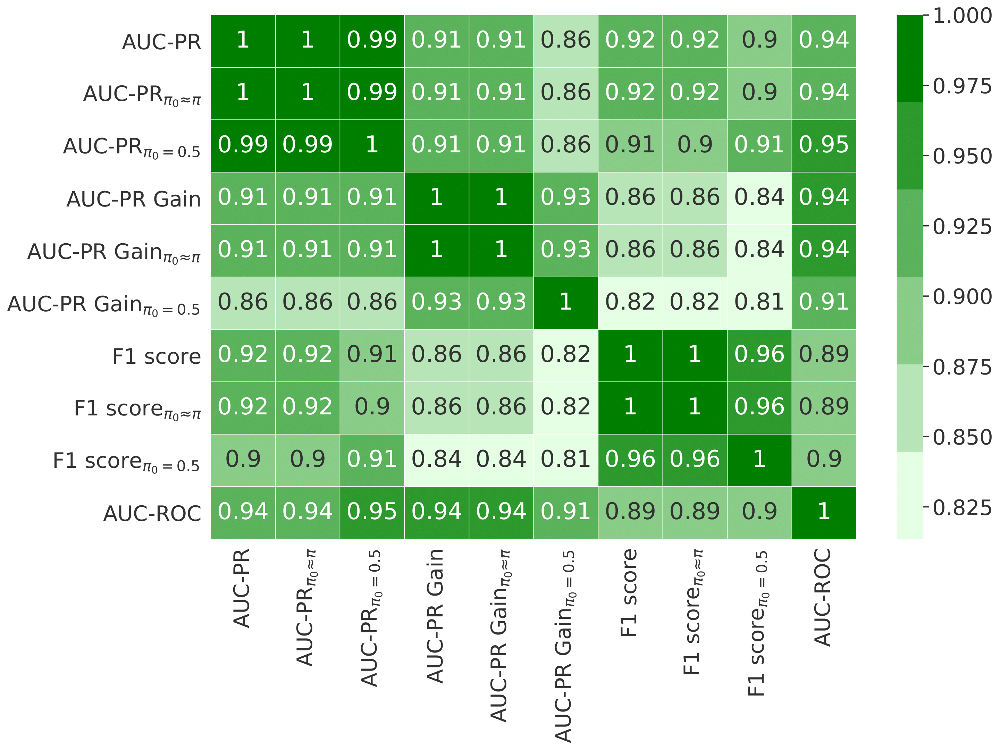
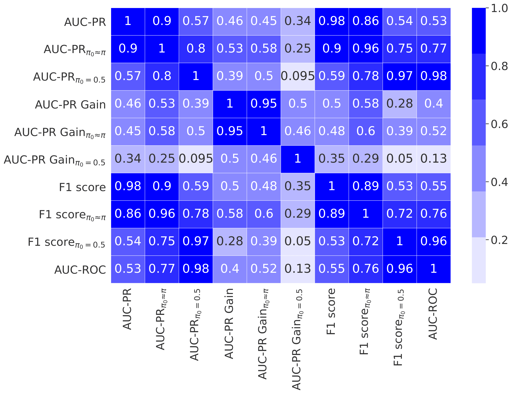

# Calibrated Precision

This repository provides python codes to reproduce the experimental results from paper **["Master your Metrics with Calibration" Wissam Siblini, Jordan Fréry, Liyun He-Guelton, Frédéric Oblé and Yi-Qing Wang (IDA 2020)](https://link.springer.com/chapter/10.1007%2F978-3-030-44584-3_36).** (**[pdf](https://link.springer.com/content/pdf/10.1007%2F978-3-030-44584-3_36.pdf)**)

It includes the implementation of the calibrated precision as well as the calibrated f-score (in ``calibrated_metrics.py``), the calibrated average precision (in ``calibrated_metrics.py``) and the calibrated precision-recall gain (in ``prgc.py``). It also includes a notebook (``paper_experiments.ipynb``) that allows to reproduce all the results from the paper.

## Usage

### Calibrated f-score, calibrated average precision

The calibated average-precision (or aucpr) is based on **[scikit-learn's implementation of the average-precision](https://scikit-learn.org/stable/modules/generated/sklearn.metrics.average_precision_score.html)** and is implemented as an extra parameter:

```python
from calibrated_metrics import average_precision
average_precision(y_true, y_pred, pos_label=1, sample_weight=None,pi0=None)
```

If pi0 is None, the function computes the regular average precision. Otherwise it computes the calibrated average precision with parameter pi0. 

The calibated f1-score is also implemented as a special case of the f1-score : 

```python
from calibrated_metrics import f1score
f1score(y_true, y_pred, pi0=None)
```

### Calibrated pr-gain

Calibrated precision gain, recall gain and auc-pr-gain are based on the implementation of the **[regular ones](https://github.com/meeliskull/prg)**. Calib auc-pr-gain can be computed as follows :

```python
import prgc
prgc.calc_auprg(prgc.create_prg_curve(y_true,y_pred,pi0))
```

### paper_experiments.ipynb

``paper_experiments.ipynb`` is the notebook that contains the code the experiments from the paper. It has 4 sections : 

* **Experiments with synthetic data** : it runs the experiments with synthetic data (one experiments that shows invariance of calibrated metrics wrt the positive class ration and one experiment that show that they still assess model performance)

*Invariance wrt to positive class ratio*


*Assessment of the model quality*


* **Experiment with real data** : it runs an experiment equivalent to the invariance experiment on **[a real world imbalanced dataset (you need to download the dataset to run the code)](https://www.kaggle.com/mlg-ulb/creditcardfraud)**

*Invariance wrt to positive class ratio on real data*


* **Comparison between proposed formula and heuristic** : This experiments shows empirically that the calibrated precision with parameter pi0 is equivalent to the precision that would be obtained if the positive class ratio pi was equal to pi0.

*Comparison between heuristic based calibration and formula based calibration*



* **Experiments on openml** : The experiments in this section shows how calibration and the choice of metric impacts the selection of the best model. It empirically analyzes the correlation of several metrics in terms of model ordering. We use OpenML to select the 602 supervised binary classification datasets on which at least 30 models have been evaluated with a 10-fold cross-validation. For each one, we randomly choose 30 models, fetch their predictions, and evaluate their performance with the metrics. We then compute the Spearman
model rank correlation matrix between the metrics. We also run the same experiment on the subset of 4 most imbalanced datasets. 

*Metrics correlation matrix in terms of model ordering on 602 datasets*



*Metrics correlation matrix in terms of model ordering on the 4 most unbalanced datasets*



## Citation

If you use the code in this repository, please cite :

```
Siblini W., Fréry J., He-Guelton L., Oblé F., Wang YQ. (2020) Master Your Metrics with Calibration. In: Berthold M., Feelders A., Krempl G. (eds) Advances in Intelligent Data Analysis XVIII. IDA 2020. Lecture Notes in Computer Science, vol 12080. Springer, Cham
```

## References

Pedregosa, F., Varoquaux, G., Gramfort, A., Michel, V., Thirion, B., Grisel, O., ... & Vanderplas, J. (2011). Scikit-learn: Machine learning in Python. Journal of machine learning research, 12(Oct), 2825-2830.

Flach, P., & Kull, M. (2015). Precision-recall-gain curves: PR analysis done right. In Advances in neural information processing systems (pp. 838-846).
